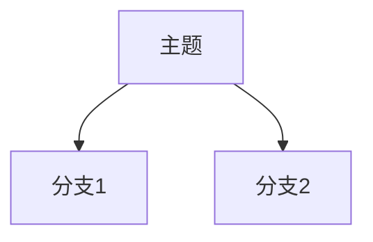

# 快速开始: Web Clipper & Assistant

**功能分支**: `001-web-clipper-core`
**创建时间**: 2025-12-14

## 概述

本文档描述如何设置和运行 Web Clipper 系统，包括浏览器扩展和本地 Go 服务。

## 前置条件

### 开发环境

- **Go**: 1.21 或更高版本
- **浏览器**: Chrome 或 Edge (Chromium 内核)
- **Obsidian**: 已安装并有一个 Vault

### 验证 Go 安装

```bash
go version
# 输出: go version go1.21.x ...
```

## 安装步骤

### 1. 克隆仓库

```bash
git clone <repository-url>
cd obsidian_web_clipper
```

### 2. 启动后端服务

```bash
# 进入服务器目录
cd server

# 首次运行: 下载依赖
go mod download

# 创建配置文件
cp config.example.yaml config.yaml

# 编辑配置文件
# - 设置 vault.path 为你的 Obsidian Vault 路径
# - 设置 auth.token 为一个安全的 Token
vim config.yaml

# 启动服务
go run main.go
# 或构建后运行
go build -o clipper-server && ./clipper-server
```

**配置文件示例 (config.yaml)**:

```yaml
server:
  port: 18080
  maxBodySize: "100MB"

auth:
  token: "your-secret-token-here"

vault:
  path: "/Users/your-name/Documents/ObsidianVault"
  subdir: "Inbox/WebClips"

logging:
  level: "info"
```

**验证服务运行**:

```bash
curl http://localhost:18080/health
# 输出: {"status":"ok"}
```

### 3. 安装浏览器扩展

#### Chrome / Edge

1. 打开浏览器，访问 `chrome://extensions/` (Chrome) 或 `edge://extensions/` (Edge)
2. 开启"开发者模式"（右上角开关）
3. 点击"加载已解压的扩展程序"
4. 选择项目中的 `extension/` 目录

#### 配置扩展

1. 点击扩展图标 → 选项 (Options)
2. 设置服务器地址: `http://localhost:18080`
3. 设置 Auth Token: 与后端 `config.yaml` 中相同的 Token
4. (可选) 配置 AI 服务 API Key

## 使用方法

### 基础剪藏 (P1)

1. 在浏览器中打开任意文章页面
2. 点击工具栏中的扩展图标
3. 点击"保存"按钮
4. 等待保存完成提示
5. 在 Obsidian 中查看 `Inbox/WebClips/{日期}/{文章标题}/` 目录

### 高亮与笔记 (P2)

1. 在网页上选中想要高亮的文本
2. 在弹出的悬浮菜单中选择:
   - "高亮": 仅添加黄色背景
   - "高亮+批注": 添加高亮并输入批注
3. 继续阅读，添加更多高亮
4. 点击"保存"时，所有高亮会导出到 Markdown 的"我的笔记"区域

### AI 总结 (P3)

1. 确保在扩展选项中已配置 AI 服务
2. 保存文章时，系统会自动调用 AI 生成总结
3. 总结包含:
   - 核心观点列表
   - 论据引用
   - Mermaid 逻辑图

## 目录结构

保存后的文件结构:

```
ObsidianVault/
└── Inbox/
    └── WebClips/
        └── 2025-12-14/
            └── 文章标题/
                ├── 文章标题.md      # 主文件
                └── assets/          # 图片
                    ├── a1b2c3d4.png
                    └── e5f6g7h8.jpg
```

## Markdown 文件格式

```markdown
---
title: "文章标题"
url: "https://example.com/article"
date: 2025-12-14
tags:
  - 标签1
  - 标签2
---

## AI 摘要

### 核心观点

- 论点 1
- 论点 2
- 论点 3

### 逻辑关系图



---

## 我的笔记

> **高亮**: 被高亮的文本
> 
> 💬 批注: 我的批注内容

---

## 正文

[文章正文 Markdown 内容]
```

## 常见问题

### Q: 无法连接到本地服务

**症状**: 扩展显示"无法连接到本地服务"

**解决方案**:
1. 确认后端服务正在运行: `curl http://localhost:18080/health`
2. 检查端口是否被占用: `lsof -i :18080`
3. 验证扩展中的服务器地址配置正确

### Q: 认证失败

**症状**: 保存时提示"认证失败"

**解决方案**:
1. 确认扩展和后端使用相同的 Auth Token
2. 重新加载扩展后重试

### Q: 图片未保存

**症状**: Markdown 中图片显示为远程 URL 而非本地路径

**可能原因**:
1. 图片超过 5MB 限制 → 正常行为
2. 图片跨域受限 → 正常行为，降级为远程 URL
3. 图片下载超时 → 检查网络连接

### Q: 中文文件名乱码 (Windows)

**解决方案**:
- 后端使用 UTF-8 编码写入文件
- 确保 Git 配置: `git config core.quotepath false`

## 开发调试

### 后端日志

```bash
# 设置 DEBUG 日志级别
# 在 config.yaml 中:
logging:
  level: "debug"
```

### 扩展调试

1. 打开扩展管理页面
2. 点击"Service Worker" 链接查看后台日志
3. 右键扩展图标 → 审查弹出内容

### API 测试

```bash
# 健康检查
curl http://localhost:18080/health

# 测试保存 (需替换 Token)
curl -X POST http://localhost:18080/api/v1/save \
  -H "Content-Type: application/json" \
  -H "Authorization: Bearer your-token" \
  -d '{"metadata":{"title":"Test","url":"http://test.com","domain":"test.com","savedAt":"2025-12-14T00:00:00Z","tags":[]},"content":{"markdown":"# Test","aiSummary":null,"highlights":[]},"assets":[]}'
```

## 构建生产版本

### 后端

```bash
cd server

# Linux
GOOS=linux GOARCH=amd64 go build -o clipper-server-linux

# macOS (Intel)
GOOS=darwin GOARCH=amd64 go build -o clipper-server-mac

# macOS (Apple Silicon)
GOOS=darwin GOARCH=arm64 go build -o clipper-server-mac-arm

# Windows
GOOS=windows GOARCH=amd64 go build -o clipper-server.exe
```

### 扩展

扩展为纯静态文件，无需构建。发布时打包 `extension/` 目录即可。

## 下一步

- 阅读 [API 合约](./contracts/save-api.md) 了解接口详情
- 阅读 [数据模型](./data-model.md) 了解数据结构
- 运行 `/speckit.tasks` 查看实施任务列表
